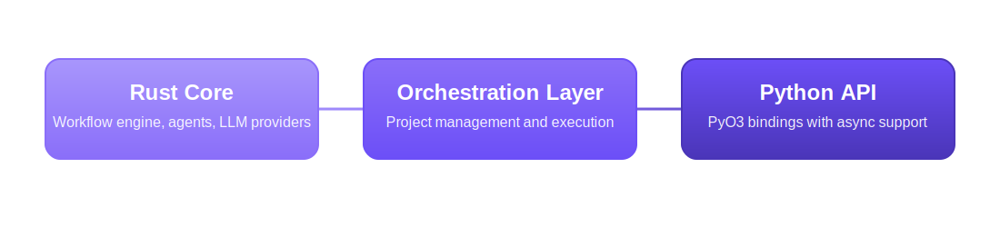
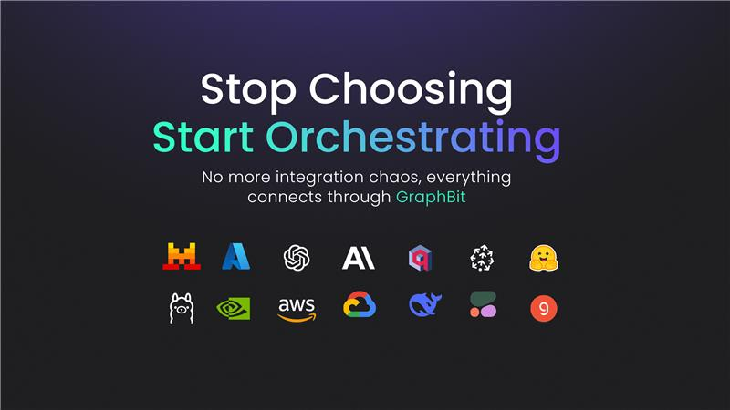

<div align="center">

# GraphBit - Framework Agêntico de Alto Desempenho (Português)

<p align="center">
    
</p>
<p align="center">
     
</p>

<p align="center">
    <a href="https://graphbit.ai/">Website</a> |
    <a href="https://docs.graphbit.ai/">Docs</a> |
    <a href="https://discord.com/invite/huVJwkyu">Discord</a>
    <br /><br />
</p>

</p>

<p align="center">
    <a href="https://trendshift.io/repositories/14884" target="_blank"></a>
    <br>
    <a href="https://pepy.tech/projects/graphbit"></a>
</p>

<p align="center">
    <a href="https://pypi.org/project/graphbit/"></a>
    <a href="https://pypi.org/project/graphbit/"></a>
    <a href="https://github.com/InfinitiBit/graphbit/actions/workflows/update-docs.yml"></a>
    <a href="https://github.com/InfinitiBit/graphbit/blob/main/CONTRIBUTING.md"></a>
    <br>
    <a href="https://www.rust-lang.org"></a>
    <a href="https://www.python.org"></a>
    <a href="https://github.com/InfinitiBit/graphbit/blob/main/LICENSE.md"></a>

</p>
<p align="center">
    <a href="https://www.youtube.com/@graphbitAI"></a>
    <a href="https://x.com/graphbit_ai"></a>
    <a href="https://discord.com/invite/huVJwkyu"></a>
    <a href="https://www.linkedin.com/showcase/graphbitai/"></a>
</p>

**Fluxos de Trabalho de Agentes IA com Segurança de Tipos e Desempenho Rust**

</div>

---

🚧 **Tradução em andamento** - Este documento está sendo traduzido do inglês.

📖 **[Read in English](../README.md)** | **[Ler em inglês](../README.md)**

---

**Ler em outros idiomas**: [🇨🇳 简体中文](README.zh-CN.md) | [🇨🇳 繁體中文](README.zh-TW.md) | [🇪🇸 Español](README.es.md) | [🇫🇷 Français](README.fr.md) | [🇩🇪 Deutsch](README.de.md) | [🇯🇵 日本語](README.ja.md) | [🇰🇷 한국어](README.ko.md) | [🇮🇳 हिन्दी](README.hi.md) | [🇸🇦 العربية](README.ar.md) | [🇮🇹 Italiano](README.it.md) | [🇷🇺 Русский](README.ru.md) | [🇧🇩 বাংলা](README.bn.md)

---

## Sobre o GraphBit

GraphBit é um framework de IA agêntico de código-fonte disponível para desenvolvedores que precisam de execução determinística, concorrente e de baixa sobrecarga.

## Por que GraphBit?

A eficiência decide quem escala. GraphBit foi construído para desenvolvedores que precisam de execução de IA determinística, concorrente e ultra-eficiente sem sobrecarga.

Construído com um núcleo Rust e uma camada Python mínima, GraphBit oferece até 68× menos uso de CPU e 140× menos pegada de memória do que outros frameworks, mantendo throughput igual ou superior.

Ele alimenta fluxos de trabalho multi-agente que executam em paralelo, persistem memória entre etapas, se auto-recuperam de falhas e garantem 100% de confiabilidade de tarefas. GraphBit foi construído para cargas de trabalho de produção, desde sistemas de IA empresariais até implantações edge com recursos limitados.

## Recursos Principais

- **Seleção de Ferramentas** - LLMs escolhem ferramentas inteligentemente com base em descrições
- **Segurança de Tipos** - Tipagem forte em cada camada de execução
- **Confiabilidade** - Disjuntores, políticas de retry, tratamento de erros e recuperação de falhas
- **Suporte Multi-LLM** - OpenAI, Azure OpenAI, Anthropic, OpenRouter, DeepSeek, Replicate, Ollama, TogetherAI e mais
- **Gerenciamento de Recursos** - Controles de concorrência e otimização de memória
- **Observabilidade** - Rastreamento integrado, logs estruturados e métricas de desempenho

## Benchmark

GraphBit foi construído para eficiência em escala, não afirmações teóricas, mas resultados medidos.

Nossa suíte de benchmarks interna comparou GraphBit com os principais frameworks de agentes baseados em Python em cargas de trabalho idênticas.

| Métrica             | GraphBit        | Outros Frameworks | Ganho                    |
|:--------------------|:---------------:|:----------------:|:-------------------------|
| Uso de CPU          | 1.0× base       | 68.3× maior      | ~68× CPU                 |
| Pegada de Memória   | 1.0× base       | 140× maior       | ~140× Memória            |
| Velocidade de Execução | ≈ igual / mais rápido | —         | Throughput consistente   |
| Determinismo        | 100% sucesso    | Variável         | Confiabilidade garantida |

GraphBit oferece consistentemente eficiência de nível de produção em chamadas LLM, invocações de ferramentas e cadeias multi-agente.

### Demo de Benchmark

<div align="center">
  <a href="https://www.youtube.com/watch?v=MaCl5oENeAY">
    
  </a>
  <p><em>Assista à Demo de Benchmark do GraphBit</em></p>
</div>

## Quando Usar GraphBit

Escolha GraphBit se você precisa de:

- Sistemas multi-agente de nível de produção que não colapsam sob carga
- Execução type-safe e saídas reproduzíveis
- Orquestração em tempo real para aplicações de IA híbridas ou streaming
- Eficiência em nível Rust com ergonomia em nível Python

Se você está escalando além de protótipos ou se importa com determinismo de runtime, GraphBit é para você.

## Início Rápido

### Instalação

Recomenda-se usar um ambiente virtual.

```bash
pip install graphbit
```

### Tutorial em Vídeo de Início Rápido

<div align="center">
  <a href="https://youtu.be/ti0wbHFKKFM?si=hnxi-1W823z5I_zs">
    
  </a>
  <p><em>Assista ao tutorial de Instalação do GraphBit via PyPI | Guia Completo de Exemplo e Execução</em></p>
</div>


### Configuração do Ambiente

Configure as chaves de API que você deseja usar em seu projeto:
```bash
# OpenAI (opcional – necessário se estiver usando modelos OpenAI)
export OPENAI_API_KEY=your_openai_api_key_here

# Anthropic (opcional – necessário se estiver usando modelos Anthropic)
export ANTHROPIC_API_KEY=your_anthropic_api_key_here
```

> **Nota de Segurança**: Nunca faça commit de chaves de API no controle de versão. Sempre use variáveis de ambiente ou gerenciamento seguro de segredos.

### Uso Básico
```python
import os

from graphbit import LlmConfig, Executor, Workflow, Node, tool

# Inicializar e configurar
config = LlmConfig.openai(os.getenv("OPENAI_API_KEY"), "gpt-4o-mini")

# Criar executor
executor = Executor(config)

# Criar ferramentas com descrições claras para seleção do LLM
@tool(_description="Obter informações meteorológicas atuais para qualquer cidade")
def get_weather(location: str) -> dict:
    return {"location": location, "temperature": 22, "condition": "sunny"}

@tool(_description="Realizar cálculos matemáticos e retornar resultados")
def calculate(expression: str) -> str:
    return f"Result: {eval(expression)}"

# Construir fluxo de trabalho
workflow = Workflow("Analysis Pipeline")

# Criar nós de agente
smart_agent = Node.agent(
    name="Smart Agent",
    prompt="What's the weather in Paris and calculate 15 + 27?",
    system_prompt="You are an assistant skilled in weather lookup and math calculations. Use tools to answer queries accurately.",
    tools=[get_weather, calculate]
)

processor = Node.agent(
    name="Data Processor",
    prompt="Process the results obtained from Smart Agent.",
    system_prompt="""You process and organize results from other agents.

    - Summarize and clarify key points
    - Structure your output for easy reading
    - Focus on actionable insights
    """
)

# Conectar e executar
id1 = workflow.add_node(smart_agent)
id2 = workflow.add_node(processor)
workflow.connect(id1, id2)

result = executor.execute(workflow)
print(f"Workflow completed: {result.is_success()}")
print("\nSmart Agent Output: \n", result.get_node_output("Smart Agent"))
print("\nData Processor Output: \n", result.get_node_output("Data Processor"))
```

## Observabilidade e Rastreamento

GraphBit Tracer captura e monitora chamadas LLM e fluxos de trabalho de IA com configuração mínima. Ele envolve clientes LLM GraphBit e executores de fluxo de trabalho para rastrear prompts, respostas, uso de tokens, latência e erros sem alterar seu código.

<div align="center">
  <a href="https://www.youtube.com/watch?v=nzwrxSiRl2U">
    
  </a>
  <p><em>Assista ao tutorial de Observabilidade e Rastreamento do GraphBit</em></p>
</div>

## Arquitetura de Alto Nível

<p align="center">
  
</p>

Design de três camadas para confiabilidade e desempenho:
- **Núcleo Rust** - Motor de fluxo de trabalho, agentes e provedores LLM
- **Camada de Orquestração** - Gerenciamento e execução de projetos
- **API Python** - Bindings PyO3 com suporte assíncrono

## Integrações de API Python

GraphBit fornece uma API Python rica para construir e integrar fluxos de trabalho agênticos:

- **Clientes LLM** - Integrações LLM multi-provedor (OpenAI, Anthropic, Azure e mais)
- **Fluxos de Trabalho** - Definir e gerenciar gráficos de fluxo de trabalho multi-agente com gerenciamento de estado
- **Nós** - Nós de agente, nós de ferramenta e componentes de fluxo de trabalho personalizados
- **Executores** - Motor de execução de fluxo de trabalho com gerenciamento de configuração
- **Sistema de Ferramentas** - Decoradores de função, registro e framework de execução para ferramentas de agente
- **Resultados de Fluxo de Trabalho** - Resultados de execução com metadados, temporização e acesso à saída
- **Embeddings** - Embeddings vetoriais para busca semântica e recuperação
- **Contexto de Fluxo de Trabalho** - Estado compartilhado e variáveis através da execução do fluxo de trabalho
- **Carregadores de Documentos** - Carregar e analisar documentos de múltiplos formatos (PDF, DOCX, TXT, JSON, CSV, XML, HTML)
- **Divisores de Texto** - Dividir documentos em blocos (caractere, token, sentença, recursivo)

Para a lista completa de classes, métodos e exemplos de uso, consulte a [Referência da API Python](docs/api-reference/python-api.md).

## Documentação

Para documentação completa, visite: [https://docs.graphbit.ai/](https://docs.graphbit.ai/)

## Ecossistema e Extensões

A arquitetura modular do GraphBit suporta integrações externas:

| Categoria         | Exemplos                                                                                      |
|:------------------|:----------------------------------------------------------------------------------------------|
| Provedores LLM    | OpenAI, Anthropic, Azure OpenAI, DeepSeek, Together, Ollama, OpenRouter, Fireworks, Mistral AI, Replicate, Perplexity, HuggingFace, AI21, Bytedance, xAI, e mais |
| Armazenamentos Vetoriais | Pinecone, Qdrant, Chroma, Milvus, Weaviate, FAISS, Elasticsearch, AstraDB, Redis, e mais |
| Bancos de Dados   | PostgreSQL (PGVector), MongoDB, MariaDB, IBM DB2, Redis, e mais                               |
| Plataformas Cloud | AWS (Boto3), Azure, Google Cloud Platform, e mais                                             |
| APIs de Busca     | Serper, Google Search, GitHub Search, GitLab Search, e mais                                   |
| Modelos de Embedding | OpenAI Embeddings, Voyage AI, e mais                                                       |

As extensões são desenvolvidas e mantidas pela comunidade.

<p align="center">
  
</p>


### Construindo Seu Primeiro Fluxo de Trabalho de Agente com GraphBit

<div align="center">
  <a href="https://www.youtube.com/watch?v=gKvkMc2qZcA">
    
  </a>
  <p><em>Assista ao tutorial de Criação de Fluxo de Trabalho de Agente com GraphBit</em></p>
</div>

## Contribuir para o GraphBit

Recebemos contribuições. Para começar, consulte o arquivo [Contributing](CONTRIBUTING.md) para configuração de desenvolvimento e diretrizes.

GraphBit é construído por uma maravilhosa comunidade de pesquisadores e engenheiros.

<a href="https://github.com/Infinitibit/graphbit/graphs/contributors">
  
</a>

## Segurança

Se você descobrir uma vulnerabilidade de segurança, relate-a responsavelmente através do GitHub Security ou por e-mail em vez de criar um problema público.

Para procedimentos detalhados de relatório e prazos de resposta, consulte nossa [Security Policy](SECURITY.md).

## Licença

GraphBit é licenciado sob um modelo de três níveis: **Modelo A (Uso Gratuito)** para indivíduos, instituições acadêmicas e pequenas equipes (até 10 funcionários/usuários), **Modelo B (Teste Gratuito)** para avaliação de 30 dias, e **Modelo C (Enterprise)** para uso comercial/produção. A redistribuição é proibida sob todos os modelos sem uma Licença Enterprise explícita.

Para termos e condições completos, consulte a [Full License](LICENSE.md).

Copyright © 2023–2026 InfinitiBit GmbH. All rights reserved.

---

**Nota**: Esta tradução é mantida pela comunidade. Se você encontrar erros ou desejar melhorar a tradução, envie um Pull Request.

