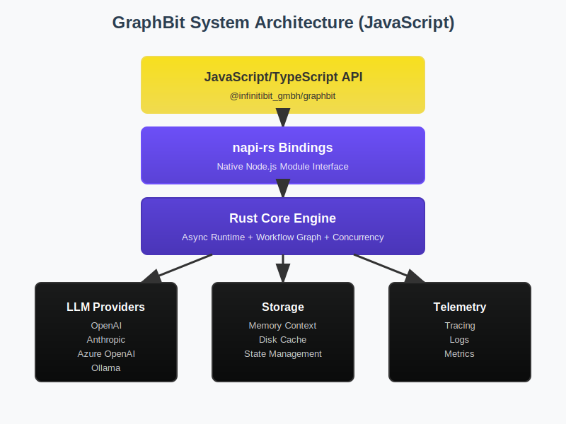

# Architecture Guide - JavaScript

This guide covers the architectural design of GraphBit's JavaScript bindings, their integration with the Rust core, and patterns for building production applications.

## System Architecture



## Overview

GraphBit's JavaScript architecture consists of three layers:

```
┌─────────────────────────────────────────┐
│   JavaScript Application Code           │
│   (Node.js + TypeScript)                │
├─────────────────────────────────────────┤
│   napi-rs Bindings                      │
│   (Type bridges, promise handling)      │
├─────────────────────────────────────────┤
│   Rust Core (graphbit-core)             │
│   (Async executor, workflow engine)     │
├─────────────────────────────────────────┤
│   Native Runtime                        │
│   (jemalloc, tokio, system I/O)        │
└─────────────────────────────────────────┘
```

## Core Components

### 1. LlmConfig

**Purpose**: Unified LLM provider configuration

**Architecture**:
```
LlmConfig
├── OpenAI
│   ├── API Key
│   ├── Model
│   └── Temperature
├── Anthropic
│   ├── API Key
│   ├── Model
│   └── Max Tokens
├── Ollama (Local)
│   ├── Base URL
│   └── Model
└── Custom (OpenRouter, etc.)
    ├── Base URL
    ├── API Key
    └── Headers
```

**Design Rationale**:
- Single interface for all providers
- Type-safe configuration
- Lazy validation (checked on use, not construction)
- Serializable to JSON for persistence

### 2. LlmClient

**Purpose**: Execute LLM requests with built-in features

**Architecture**:
```
LlmClient
├── Configuration
│   └── Retry policy
├── Request Methods
│   ├── complete() - Single request
│   ├── completeBatch() - Multiple requests
│   └── stream() - Streaming response
└── Error Handling
    ├── Network retries
    ├── Rate limit backoff
    └── Timeout management
```

**Design Rationale**:
- Encapsulates request/response handling
- Built-in resilience (retries, timeouts)
- Consistent API across all LLM providers
- Async/await native with promises

### 3. Executor

**Purpose**: Orchestrates workflow execution

**Architecture**:
```
Executor
├── Configuration
│   ├── LlmConfig
│   ├── Concurrency limits
│   └── Timeout settings
├── Execution Pipeline
│   ├── Workflow validation
│   ├── Node orchestration
│   ├── Tool execution
│   └── Result collection
└── Performance Tuning
    ├── Thread pool sizing
    ├── Memory management
    └── GC optimization
```

**Design Rationale**:
- Manages overall execution lifecycle
- Controls concurrency and resource usage
- Provides observability hooks
- Supports low-latency and high-throughput modes

### 4. Workflow & Node

**Purpose**: Workflow definition and composition

**Architecture**:
```
Workflow
├── Directed Acyclic Graph (DAG)
│   └── petgraph backend (Rust)
├── Node Types
│   ├── Agent nodes (LLM execution)
│   ├── Task nodes (computation)
│   ├── Condition nodes (branching)
│   └── Parallel nodes (concurrent execution)
└── Execution Context
    ├── Variables (state)
    ├── Results (outputs)
    └── History (audit trail)
```

**Design Rationale**:
- DAG structure prevents infinite loops
- Multiple node types support complex workflows
- Context threading for state management
- Validation before execution prevents runtime errors

### 5. ToolRegistry

**Purpose**: Runtime tool management and execution

**Architecture**:
```
ToolRegistry
├── Tool Storage
│   └── In-memory registry
├── Tool Interface
│   ├── Name
│   ├── Description (for LLM)
│   ├── Input schema (JSON Schema)
│   └── Handler function
└── Execution
    ├── Schema validation
    ├── Error handling
    └── Result serialization
```

**Design Rationale**:
- Tools are registered at runtime
- Schema-driven validation
- LLM-aware descriptions for tool selection
- Supports both sync and async handlers

## Data Flow Architecture

### Workflow Execution Flow


### Node Processing Pipeline


## Async Model

GraphBit uses **async/await** throughout for non-blocking operations:

```typescript
import { init, LlmConfig, LlmClient, Executor, Workflow, Node } from '@infinitibit_gmbh/graphbit';

// All operations are async
async function workflowExample() {
  init();

  const config = LlmConfig.openai({ apiKey: 'sk-...' });
  const client = new LlmClient(config);

  // Client operations return Promises
  const result = await client.complete('Hello');

  // Workflow construction can be sync or async
  const workflow = new Workflow('Example');
  const node = Node.agent('Agent', 'Task', 'agent_1');
  
  await workflow.addNode(node);
  await workflow.validate();

  // Execution is always async
  const executor = new Executor(config);
  const executionResult = await executor.execute(workflow);
}

// Proper error handling
workflowExample().catch(error => {
  console.error('Error:', error);
  process.exit(1);
});
```

## Data Flow

### Request-Response Flow

```
JavaScript Code
    ↓
napi-rs Binding (type conversion)
    ↓
Rust Core (async executor)
    ↓
LLM Provider (HTTP request)
    ↓
Rust Core (response processing)
    ↓
napi-rs Binding (result serialization)
    ↓
JavaScript Promise (result available)
```

### Workflow Execution Flow

```
Executor.execute(Workflow)
    ↓
Validate DAG structure
    ↓
Initialize execution context
    ↓
For each node in topological order:
    ├── Resolve dependencies
    ├── Gather inputs from context
    ├── Execute node (LLM, tool, condition, etc.)
    ├── Store results in context
    └── Check for errors/timeouts
    ↓
Return execution result
```

## Memory Management

### Zero-Copy Data Transfer

GraphBit minimizes data copying between JavaScript and Rust:

```
JavaScript String
    ↓
UTF-8 pointer (no copy)
    ↓
Rust processing
    ↓
Result allocated in Rust heap
    ↓
Serialized to JSON (JS-compatible format)
    ↓
Returned to JavaScript
```

**Benefits**:
- 140× lower memory vs alternatives (per benchmarks)
- Reduced garbage collection pressure
- Better performance for large payloads

### Memory Allocator

- **Unix/Linux**: Uses `jemalloc` for efficient allocation
- **Windows**: System allocator (jemalloc not available)
- **Python bindings**: Disables jemalloc to avoid TLS conflicts
- **JavaScript**: jemalloc enabled when available

## Concurrency Model

### Thread Pool Architecture

```
Executor (main thread)
├── Worker threads (configurable pool size)
│   ├── LLM client (handles HTTP)
│   ├── Tool execution
│   └── Data processing
└── Event loop (Node.js)
    ├── Promise resolution
    ├── I/O callbacks
    └── GC coordination
```

### Execution Parallelism

```typescript
// Sequential execution (default)
node1 → node2 → node3

// Parallel execution (explicit)
Parallel(
  agent1,
  agent2,
  agent3
)
```

**Configuration**:
```typescript
const executor = Executor.newLowLatency(config);    // 1 thread
const executor = Executor.newHighThroughput(config); // CPU count
const executor = new Executor(config);              // Default (balanced)
```

## Error Handling Strategy

### Error Types

```typescript
interface ExecutionError {
  type: 'ValidationError' | 'ExecutionError' | 'TimeoutError' | 'ToolError';
  message: string;
  context?: Record<string, any>;
}
```

### Error Recovery

```
Attempt execution
    ↓
[SUCCESS] → Return result
    ↓
[TIMEOUT] → Check retry policy
    ├── Retryable → Retry with backoff
    └── Non-retryable → Return error
    ↓
[LLM ERROR] → Check circuit breaker
    ├── Open → Return error
    └── Closed → Retry with backoff
    ↓
[TOOL ERROR] → Check tool handler
    ├── Recoverable → Log & continue
    └── Fatal → Stop execution
    ↓
Return final result (success or error)
```

## Type System

### TypeScript Integration

GraphBit provides full TypeScript support:

```typescript
import { 
  LlmConfig, 
  LlmClient, 
  Executor,
  Workflow,
  Node,
  ExecutionResult
} from '@infinitibit_gmbh/graphbit';

interface MyWorkflowResult {
  summary: string;
  nextStep: string;
  confidence: number;
}

async function typedWorkflow(): Promise<MyWorkflowResult> {
  const config = LlmConfig.openai({ apiKey: 'sk-...' });
  const executor = new Executor(config);
  
  const workflow = new Workflow('TypedExample');
  const node = Node.agent('Agent', 'Process', 'agent_1');
  
  await workflow.addNode(node);
  await workflow.validate();
  
  const result = await executor.execute(workflow);
  
  if (result.isSuccess()) {
    const vars = result.variables();
    // TypeScript knows structure via generics
    return vars as MyWorkflowResult;
  } else {
    throw new Error(result.error());
  }
}
```

## Performance Characteristics

### Latency

- **Initialization**: ~50-100ms (JIT compilation)
- **Simple request**: 200-500ms (LLM call dominates)
- **Workflow execution**: Varies (depends on node count and LLM calls)

### Memory

- **Base overhead**: ~20MB (Rust runtime)
- **Per executor**: +5-10MB
- **Per workflow**: +1-2MB
- **Streaming responses**: Constant memory (buffered)

### Concurrency

- **Thread pool**: Auto-sized to CPU count
- **Low-latency mode**: Single worker thread
- **High-throughput mode**: All CPU cores
- **Max concurrent LLM calls**: Configurable (default: 10)

## Integration Patterns

### Pattern 1: Simple Sequential Workflow

```typescript
const workflow = new Workflow('Sequential');
const node1 = Node.agent('Step1', 'First', 'step1');
const node2 = Node.agent('Step2', 'Second', 'step2');

await workflow.addNode(node1);
await workflow.addNode(node2);
await workflow.connect('step1', 'step2');
await workflow.validate();

const result = await executor.execute(workflow);
```

### Pattern 2: Parallel Processing

```typescript
const workflow = new Workflow('Parallel');
const parallel = Node.parallel('ParallelWork', [
  Node.agent('Worker1', 'Task A', 'work1'),
  Node.agent('Worker2', 'Task B', 'work2'),
  Node.agent('Worker3', 'Task C', 'work3')
]);

await workflow.addNode(parallel);
await workflow.validate();

const result = await executor.execute(workflow);
```

### Pattern 3: Conditional Branching

```typescript
const workflow = new Workflow('Conditional');
const decider = Node.condition('Decide', 'Check condition', 'check');
const yes = Node.agent('YesPath', 'Yes action', 'yes');
const no = Node.agent('NoPath', 'No action', 'no');

await workflow.addNode(decider);
await workflow.addNode(yes);
await workflow.addNode(no);

await workflow.connectCondition('check', 'yes', true);
await workflow.connectCondition('check', 'no', false);
await workflow.validate();

const result = await executor.execute(workflow);
```

## Debugging and Observability

### Execution Tracing

```typescript
const result = await executor.execute(workflow);

if (result.isSuccess()) {
  // Access execution variables
  const vars = result.variables();
  console.log('Execution variables:', vars);
} else {
  console.error('Execution failed:', result.error());
}
```

### Performance Monitoring

```typescript
const start = Date.now();
const result = await executor.execute(workflow);
const duration = Date.now() - start;

console.log(`Workflow completed in ${duration}ms`);
console.log(`Success: ${result.isSuccess()}`);
```

## Best Practices

1. **Always validate workflows** before execution
   ```typescript
   await workflow.validate(); // Catches cycles, invalid connections
   ```

2. **Use appropriate executor mode**
   ```typescript
   // Low-latency for responsive apps
   const executor = Executor.newLowLatency(config);
   
   // High-throughput for batch processing
   const executor = Executor.newHighThroughput(config);
   ```

3. **Handle errors explicitly**
   ```typescript
   const result = await executor.execute(workflow);
   if (!result.isSuccess()) {
     console.error('Execution error:', result.error());
     // Implement fallback logic
   }
   ```

4. **Use appropriate timeouts**
   ```typescript
   const result = await executor.execute(workflow, {
     timeout: 30000 // 30 seconds for LLM-heavy workflows
   });
   ```

5. **Monitor resource usage**
   ```typescript
   console.log(process.memoryUsage());
   // Check heap usage, external memory (native bindings)
   ```

## Related Documentation

- [JavaScript API Reference](../api-reference/javascript-api.md)
- [Workflow Builder Guide](../user-guide/workflow-builder-js.md)
- [Tool Calling Guide](../user-guide/tool-calling-js.md)
- [Debugging Guide](./debugging-js.md)
- [JavaScript Bindings Details](./javascript-bindings.md)
