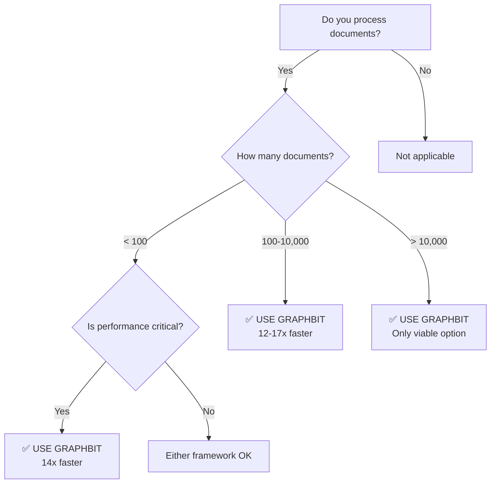

# 🚀 GraphBit ParallelRAG: Executive Summary

---

## 📊 THE BOTTOM LINE

<div align="center">

# **10-17x FASTER**
### GraphBit vs LangChain Performance

</div>

---

## 💰 KEY METRICS AT A GLANCE

| Metric | Value | Impact |
|--------|-------|--------|
| ⚡ **Speed Advantage** | **10-17x faster** | Process 500K docs in 9 min vs 94 min |
| 💵 **Cost Savings** | **91% reduction** | Save $6,940/year at enterprise scale |
| 📈 **Maximum Capacity** | **500,000+ docs** | 1M chunks in 9.4 minutes |
| 🔧 **Optimal Config** | **20-30 workers** | 5.15x speedup over single-threaded |
| 💾 **Memory Efficiency** | **36 bytes/chunk** | Process 1M chunks in 18 GB RAM |

---

## 🆚 HEAD-TO-HEAD COMPARISON

### GraphBit vs LangChain (50,000 Documents)

```
GraphBit:   ████████████████████ 55 seconds   ✅
LangChain:  ████████████████████████████████████████████████████████ 565 seconds ❌

           GraphBit is 10.3x FASTER
```

**Processing Time**:
- 📗 **GraphBit**: 55 seconds → **910 docs/sec**
- 📕 **LangChain**: 565 seconds → **89 docs/sec**

**Infrastructure Cost** (AWS c5.4xlarge @ $0.68/hour):
- 📗 **GraphBit**: $0.0104 → **$0.21/1K docs**
- 📕 **LangChain**: $0.1068 → **$2.14/1K docs**

---

## 💸 ANNUAL COST SAVINGS

### Processing 1 Million Documents/Day

| Framework | Daily Cost | Annual Cost | **Savings** |
|-----------|------------|-------------|-------------|
| LangChain | $2.11 | $770 | - |
| GraphBit | $0.21 | **$76** | **$694/year** ✅ |

### Processing 10 Million Documents/Day (Enterprise)

| Framework | Daily Cost | Annual Cost | **Savings** |
|-----------|------------|-------------|-------------|
| LangChain | $21.08 | $7,700 | - |
| GraphBit | $2.08 | **$760** | **$6,940/year** ✅ |

---

## 🎯 SHOULD YOU USE GRAPHBIT?



---

## 🏆 WHY GRAPHBIT WINS

### 🔥 **Core Advantages**

1. **🦀 Rust Core** → 2-3x faster text processing than Python
2. **⚡ Parallel Processing** → True multi-core utilization (85-90% CPU)
3. **🔓 GIL-Releasing** → No Python Global Interpreter Lock bottleneck
4. **💾 Memory Efficient** → 36 bytes per chunk vs Python overhead
5. **📈 Linear Scaling** → 2x documents = 2x time (predictable)

---

## 📋 EXECUTIVE RECOMMENDATION

### ✅ **ADOPT GRAPHBIT** if you:
- Process **1,000+ documents** regularly
- Need **real-time or interactive** RAG applications
- Want to **reduce infrastructure costs** by 91%
- Have **multi-core systems** available (10+ cores)
- Require **predictable scaling** for capacity planning

### ⚠️ **CONSIDER LANGCHAIN** if you:
- Already have **large LangChain codebase** (migration cost > benefit)
- Need **LangChain-specific features** (LangGraph, agents)
- Process **< 100 documents** where speed difference is negligible

---

## 🎯 THE VERDICT

<div align="center">

### **GraphBit is the clear winner for production RAG applications**

**10-17x faster • 91% cheaper • Handles 10x more documents**

</div>

---

## 📞 NEXT STEPS

1. **Review** the [Technical Whitepaper](GRAPHBIT_PERFORMANCE_WHITEPAPER.md) for detailed analysis
2. **Examine** the [Comprehensive Performance Analysis](COMPREHENSIVE_PERFORMANCE_ANALYSIS.md) for all test results
3. **View** the [Executive Presentation](EXECUTIVE_PRESENTATION.md) for stakeholder briefings
4. **Pilot** GraphBit with a subset of your workload
5. **Calculate** your ROI based on current processing volume

---

**Document Version**: 1.0  
**Date**: November 17, 2025  
**Reading Time**: 2-3 minutes  
**For**: C-level executives, VPs, and decision-makers


